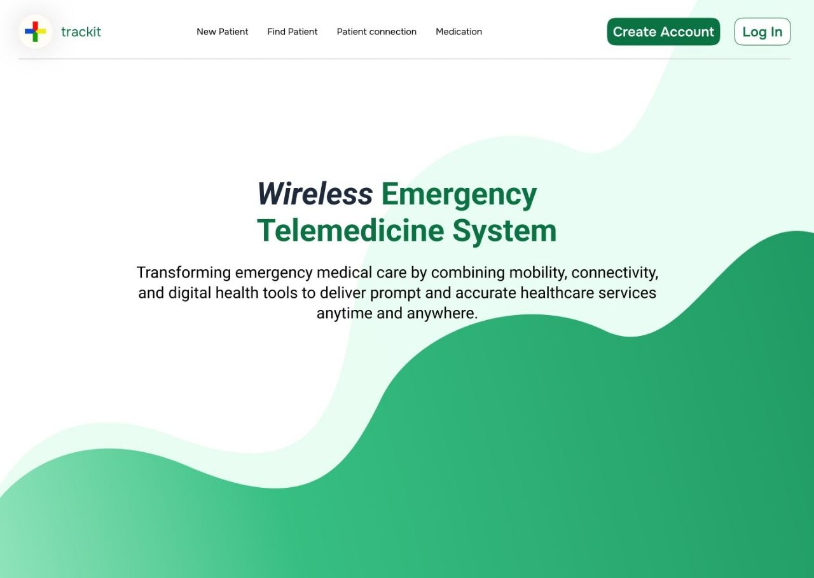
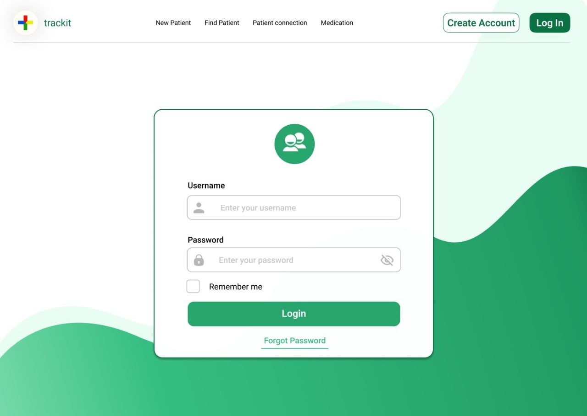
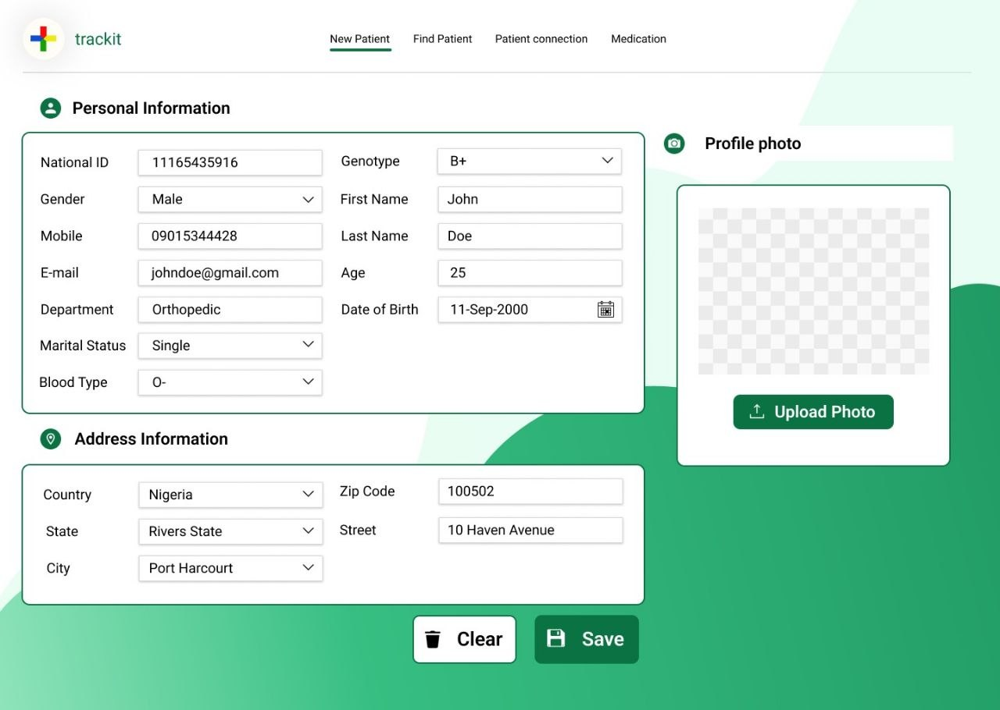
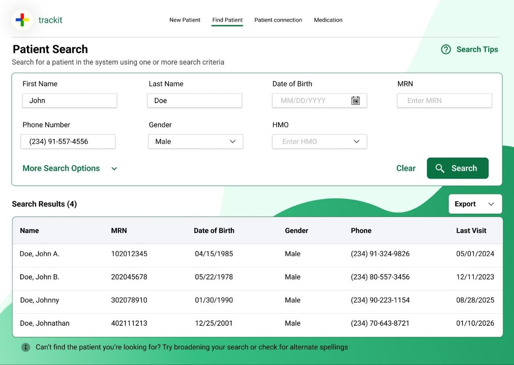
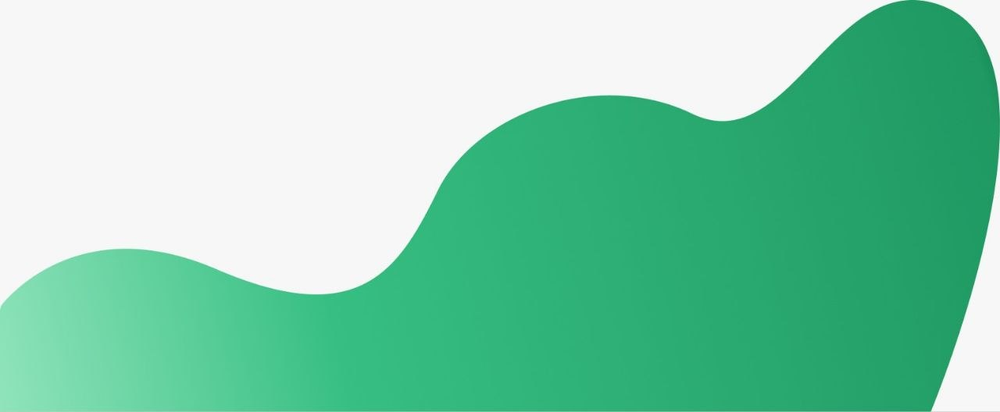
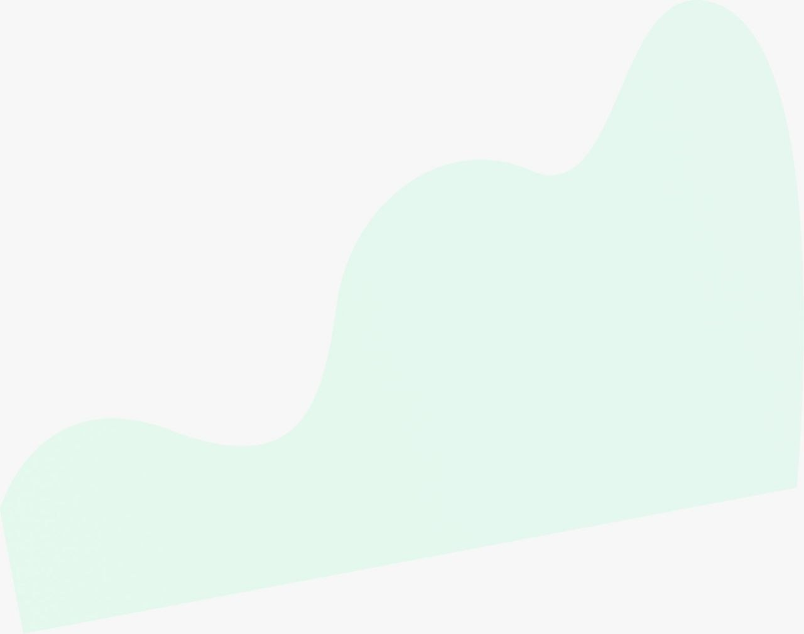

# Trackit — CMS 418

**Wireless Emergency Telemedicine System**  
Group 5 · CMS 418

---

## Overview

Trackit is a web-based telemedicine management interface that streamlines emergency patient intake, search, and records management.

This repository contains the **HTML/CSS frontend** — static pages built to match the Group 5 Figma design. No JavaScript or build tools; open a file and it runs.

---

## Screens

### Landing Page


### Login


### New Patient Registration


### Find Patient


### Wave Assets (background decorations)
| Dark green wave | Light mint wave |
|---|---|
|  |  |

---

## Pages

| File | Description |
|---|---|
| `index.html` | Landing page — hero section with tagline |
| `login.html` | Login form — username, password, remember me |
| `new-patient.html` | Patient registration — personal info, address, profile photo |
| `find-patient.html` | Patient search — filters, results table, export |

---

## Project Structure

```
CMS 418 - FRONTEND/
├── index.html            # Landing / home page
├── login.html            # Login screen
├── new-patient.html      # New patient registration form
├── find-patient.html     # Patient search and results
│
├── css/
│   └── styles.css        # Shared stylesheet — design tokens, navbar, forms
│
├── assets/
│   └── images/           # Place any image assets used by pages here
│
├── Design/               # Source design files — reference only, do not modify
│   ├── figmalink.txt     # Link to Figma source
│   └── photo_*.jpg       # Screen mockups
│
└── README.md
```

---

## Design System

All tokens are CSS custom properties in `css/styles.css`:

| Token | Value | Usage |
|---|---|---|
| `--green-dark` | `#1a6b3c` | Primary buttons, headings |
| `--green-main` | `#2e9e60` | Active nav, icons, accents |
| `--green-light` | `#d6f0e0` | Background wave blobs |
| `--text-dark` | `#1a2e3b` | Headings, strong text |
| `--text-mid` | `#374151` | Body text, labels |
| `--text-muted` | `#9ca3af` | Placeholders, hints |
| `--border` | `#d1d5db` | Input and card borders |

---

## How to Run

No build step required:

```
# Option 1 — double-click index.html in File Explorer
# Option 2 — VS Code Live Server (recommended — preserves relative links)
```

---

## Design Source

Figma: <https://www.figma.com/design/bzWCTeyq946GYyc3GkmDNK/Group-5---UI-DESIGN>

---

## Team

CMS 418 · Group 5

